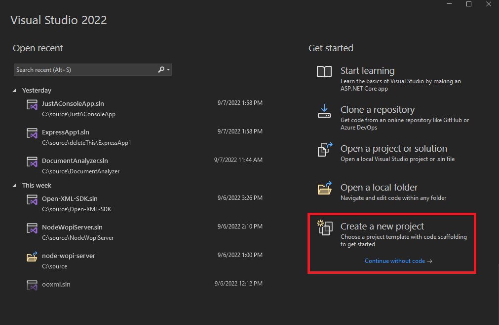
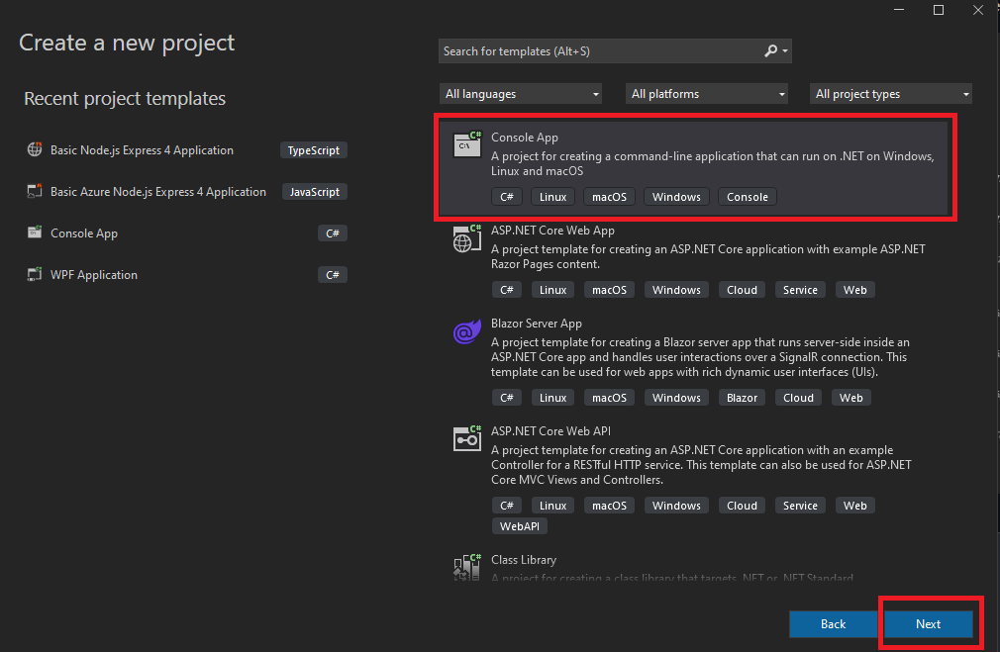
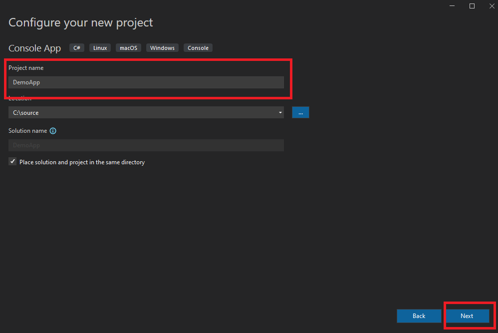
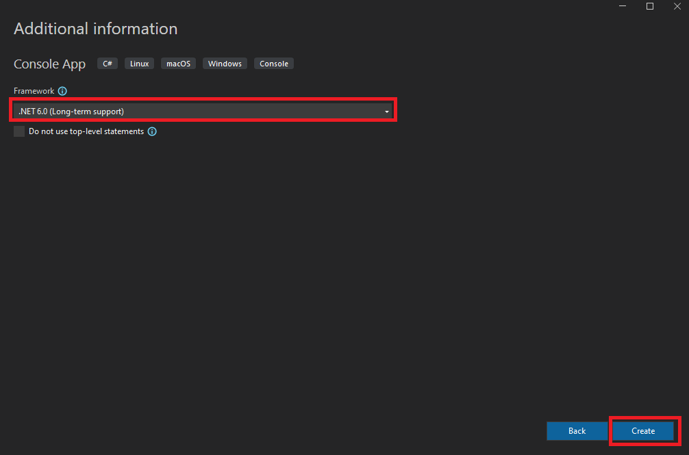

# Create Project in Visual Studio

## Create Console Application

1. Open Visual Studio and select create a new project

2. Select Console App and click Next

3. Choose a name for your app and click next.

4. Choose .NET 6.0 and click create

## Next steps

Go to the [Next Step](./install-packages.md) to install the necessary Nuget packages.