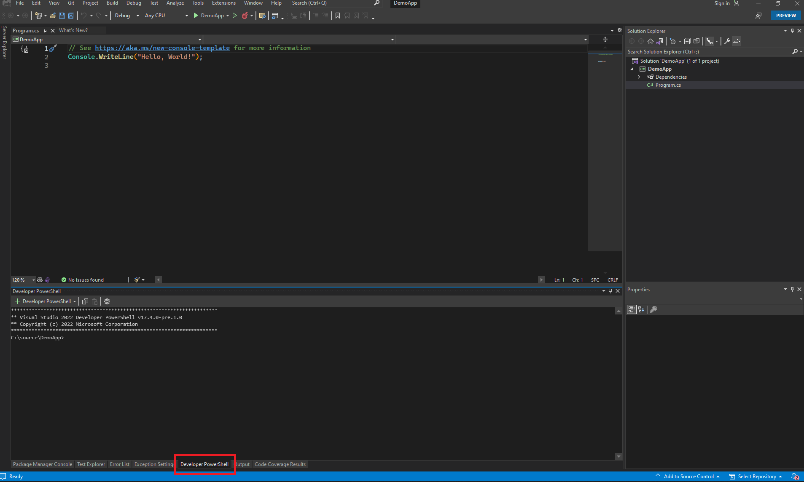

# Install the OpenXML SDK and Azure.AI.TextAnalytics

Open the developer console and enter the following commands to install the Nuget packages.

  `dotnet add package DocumentFormat.OpenXml`

  `dotnet add package Azure.AI.TextAnalytics`

Go the the [next step](write-code.md) to start adding code
