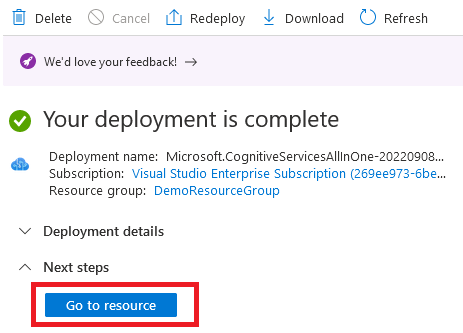

# Setup

## Create an Azure account

Go to the [Azure Website](https://azure.microsoft.com/en-us/free/) and create a free Azure account if you don't already have one.

## Create a Cognitive Services resource

1. Sign into or create your Azure account at [portal.azure.com](https://portal.azure.com)

2. Select "Create a resource".

3. Search for "Language Services" in the list of resources

4. Click "Create"

5. Click "Continue to create your resource". Do not add any custom features.

5. Select or create a Resource Group and choose a unique name for your Language Services resource then select "Free F0 (5K Transcriptions per 30 days)" for pricing tier and click Review + create.

6. Click Create, then wait for deployment to complete.

7. Select go to resource

8. Select click here to manage keys

9. Copy KEY 1 and the Endpoint to use in the next section.

[Go to Next Step](./create-project.md)
